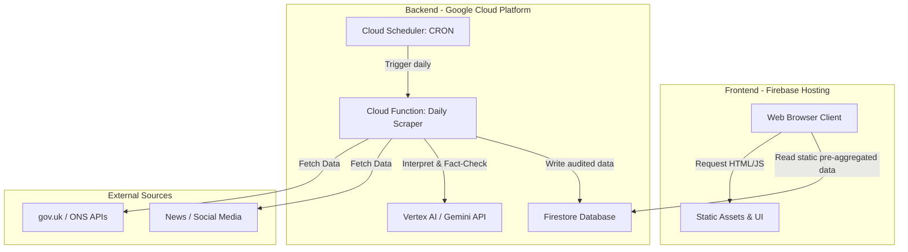

# System Architecture & Design

> **Agent Note**: This document outlines the technical design, directory structure, data models, and API definitions of the UK Housing Data Platform.

---

## 1. System Overview

### 1.1 Tech Stack
- **Frontend**: HTML/JS/CSS (Vite or Next.js static export recommended for fast loads).
- **Hosting**: Firebase Hosting (GCP native, excellent free tier, fast CDN).
- **Database**: Google Cloud Firestore (NoSQL document database, free tier suitable for read-heavy daily updated data).
- **Backend / Data Pipeline**: Cloud Scheduler + Cloud Functions (or Cloud Run) for the daily scrape job.
- **ML / AI**: Google Cloud Vertex AI / Gemini API (free tier) for NLP fact-checking and text interpretation.
- **Source Discovery**: Autonomous agent scraping with an admin-facing source registry in Firestore.

### 1.2 System Architecture Diagram



---

## 2. Directory Structure

```text
root/
├── docs/                 # Documentation (PRD, Architecture, ADRs, Roadmap, Data Pipeline)
├── frontend/             # Application source code (UI, graphs, routing)
│   ├── src/components/   # Reusable UI components (Graphs, FactCheckCards)
│   ├── src/pages/        # Core pages (Stock, Building, Policy, FactCheck)
│   └── src/services/     # Firebase SDK init and read queries
├── backend/              # Data Pipeline and Scrapers
│   ├── functions/        # Cloud Functions code for daily scrape
│   ├── scrapers/         # Source-specific scraping logic
│   └── ml/               # Prompts and interaction with Vertex AI
└── package.json          # Workspace configuration
```

---

## 3. Data Models & Database Schema (Firestore)

### 3.1 `sources` Collection (Admin Registry)
*Tracks discovered sources and their manual/automated reliability scores.*
- `id` (String): e.g., `gov-uk-housing`
- `name` (String): Source name
- `url` (String): Base URL
- `reliabilityScore` (Number): 0-100 (e.g., gov.uk = 100)
- `type` (String): `api` | `html` | `rss`

### 3.2 `factChecks` Collection
*Stores the analyzed claims from the last 12 months.*
- `claimId` (String): Unique ID
- `statement` (String): The quoted statement
- `sourceUrl` (String): Where the statement was made
- `dateMade` (Timestamp): When it was said
- `accuracyVerdict` (String): e.g., `True`, `False`, `Misleading`
- `justification` (String): ML-generated text explaining the verdict
- `referenceDataUrl` (String): Link to the ONS/Gov data proving the verdict

### 3.3 `housingStats` Collection
*Pre-aggregated documents containing time-series data for fast frontend querying.*
- Documents like `currentStock`, `historicalBuilding` containing JSON arrays of timeline metrics categorized by location and type.

---

## 4. Security & Data Flow

### 4.1 Traffic & Cost Management
To avoid unpredictable external queries and API costs:
- **No live scraping**: The frontend **NEVER** calls external news or government APIs.
- **Daily Batch**: The backend Cloud Function runs strictly once per day, processing new info, running ML tasks, and writing the final state to Firestore.
- **Firestore Reads**: The frontend only reads from Firestore (or static compiled JSON). No login is required, so Firestore security rules must be set to `read: true, write: false`.

### 4.2 Security Standards
- OWASP Top 10 mitigation: 
  - Strictly sanitize any ML-generated text before rendering in the DOM to prevent XSS.
  - Implement Content Security Policy (CSP) headers via Firebase Hosting config.
