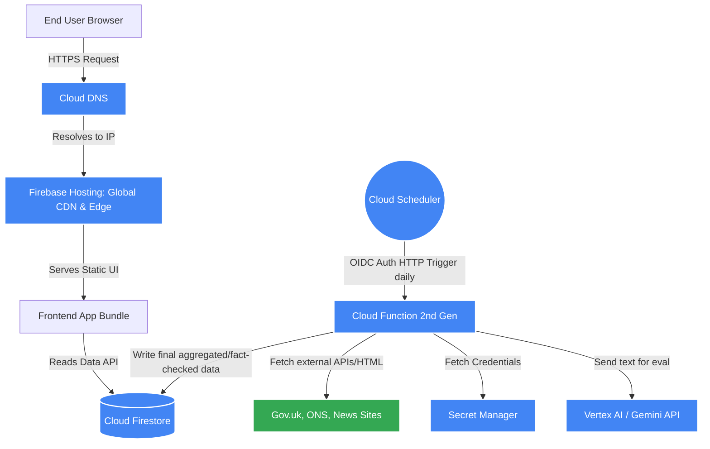

# System Architecture & Design

> **Agent Note**: This document outlines the technical design, infrastructure components, directory structure, data models, and API definitions of the UK Housing Data Platform. All cloud infrastructure (excluding the initial bootstrap) MUST be provisioned using Terraform.

---

## 1. System Overview & Component Layers

### 1.1 Infrastructure Stack
- **IaC Tooling**: Terraform (State stored in a secured GCS bucket).
- **Domain & DNS**: Google Cloud DNS.
- **CDN, WAF & Edge**: Firebase Hosting (Natively provides Fastly CDN, SSL termination, and DDoS mitigation).
- **Frontend App**: HTML/JS/CSS static bundle (Vite or Next.js static export).
- **Database**: Google Cloud Firestore (NoSQL document database).
- **Compute (Backend)**: Google Cloud Functions (2nd Gen / Cloud Run).
- **Orchestration**: Google Cloud Scheduler.
- **AI/ML**: Google Cloud Vertex AI (Gemini APIs) for NLP fact-checking.
- **Security & Secrets**: Google Cloud IAM, Google Secret Manager.

### 1.2 Detailed Component Usage & Configuration

#### A. Network & Edge Layer
1. **Cloud DNS**: Manages the domain records. **IaC Config**: Terraform `google_dns_managed_zone` and `google_dns_record_set`.
2. **Firebase Hosting (CDN/WAF)**: Serves the static frontend assets. Provides a global CDN and automatic SSL provisioning. **IaC Config**: Deployed via Firebase CLI in CI/CD, integrated with Terraform via `google_firebase_hosting_site`. Custom headers configured in `firebase.json` for strict CSP.

#### B. Storage Layer
1. **Firestore**: Stores aggregated stats and fact-check results. **IaC Config**: Configured via Terraform `google_firestore_database`.
   - **Security Rules**: Deployed via CI/CD. Configured as `read: if true; write: if false;` for public access, while backend Service Accounts bypass rules to write data.
   - **Indexes**: Composite indexes defined in `firestore.indexes.json` and deployed via CLI/IaC.

#### C. Compute & Orchestration Layer
1. **Cloud Scheduler**: Triggers the scraping pipeline. **IaC Config**: `google_cloud_scheduler_job` configured to emit an OIDC-authenticated HTTP request to the Cloud Function daily at 02:00 UTC.
2. **Cloud Functions (2nd Gen)**: Executes the Python/Node scraper and ML pipeline. **IaC Config**: `google_cloudfunctions2_function`. Configured with a dedicated Service Account, maximum timeout (e.g., 3600s), and memory limits (e.g., 1GB - 2GB) suitable for data processing.

#### D. AI & External Integrations
1. **Vertex AI API**: Evaluates text for fact-checking. **IaC Config**: API enabled via Terraform `google_project_service`. Accessed via the backend Cloud Function using Google Cloud SDK default credentials.

#### E. Security & IAM
1. **Identity and Access Management (IAM)**: 
   - **Scraper Service Account**: Granted `roles/datastore.user` (to write to Firestore), `roles/aiplatform.user` (to call Vertex AI), and `roles/secretmanager.secretAccessor` (to read external API keys if necessary).
   - **IaC Config**: Heavily utilizing `google_service_account` and `google_project_iam_member`.
2. **Secret Manager**: Stores any third-party API keys needed for scraping. **IaC Config**: `google_secret_manager_secret`.

### 1.3 System Component Flow Diagram



---

## 2. Directory Structure

```text
root/
├── docs/                 # Documentation (PRD, Architecture, ADRs, Roadmap, Data Pipeline)
├── terraform/            # Infrastructure as Code
│   ├── modules/          # Reusable Terraform modules
│   ├── envs/             # Environment configs (e.g., prod)
│   │   ├── main.tf       # Core resources (Firestore, DNS, IAM)
│   │   └── variables.tf
├── frontend/             # Application source code (UI, graphs, routing)
│   ├── src/components/   # Reusable UI components (Graphs, FactCheckCards)
│   ├── src/pages/        # Core pages (Stock, Building, Policy, FactCheck)
│   └── src/services/     # Firebase SDK init and read queries
├── backend/              # Data Pipeline and Scrapers
│   ├── functions/        # Cloud Functions code for daily scrape
│   ├── scrapers/         # Source-specific scraping logic
│   └── ml/               # Prompts and interaction with Vertex AI
├── .github/workflows/    # CI/CD pipelines for Terraform and App deployment
└── package.json          # Workspace configuration
```

---

## 3. Data Models & Database Schema (Firestore)

### 3.1 `sources` Collection (Admin Registry)
*Tracks discovered sources and their manual/automated reliability scores.*
- `id` (String): e.g., `gov-uk-housing`
- `name` (String): Source name
- `url` (String): Base URL
- `reliabilityScore` (Number): 0-100 (e.g., gov.uk = 100)
- `type` (String): `api` | `html` | `rss`

### 3.2 `factChecks` Collection
*Stores the analyzed claims from the last 12 months.*
- `claimId` (String): Unique ID
- `statement` (String): The quoted statement
- `sourceUrl` (String): Where the statement was made
- `dateMade` (Timestamp): When it was said
- `accuracyVerdict` (String): e.g., `True`, `False`, `Misleading`
- `justification` (String): ML-generated text explaining the verdict
- `referenceDataUrl` (String): Link to the ONS/Gov data proving the verdict

### 3.3 `housingStats` Collection
*Pre-aggregated documents containing time-series data for fast frontend querying.*
- Documents like `currentStock`, `historicalBuilding` containing JSON arrays of timeline metrics categorized by location and type.

---

## 4. Security & Data Flow

### 4.1 Traffic & Cost Management
To avoid unpredictable external queries and API costs:
- **No live scraping**: The frontend **NEVER** calls external news or government APIs.
- **Daily Batch**: The backend Cloud Function runs strictly once per day, processing new info, running ML tasks, and writing the final state to Firestore.
- **Firestore Reads**: The frontend only reads from Firestore (or static compiled JSON). No login is required, so Firestore security rules must be set to `read: true, write: false`.

### 4.2 Security Standards
- OWASP Top 10 mitigation: 
  - Strictly sanitize any ML-generated text before rendering in the DOM to prevent XSS.
  - Implement Content Security Policy (CSP) headers via Firebase Hosting config.

---

## 5. Manual / Click-Ops Instructions

While 99% of the infrastructure is managed by Terraform, the following steps *cannot* be fully automated via standard IaC without chicken-and-egg problems, and must be performed manually by an administrator:

1. **GCP Project & Billing Creation**:
   - Go to Google Cloud Console > Create Project.
   - Go to Billing > Link the new project to an active Billing Account.
2. **Terraform Bootstrap**:
   - Create a Google Cloud Storage (GCS) bucket to hold the Terraform state (e.g., `gs://uk-housing-tf-state`). Enable Object Versioning.
   - Create a Terraform Service Account manually, grant it `roles/owner` or `roles/editor` + `roles/resourcemanager.projectIamAdmin`, and download the JSON key (or set up Workload Identity Federation for GitHub Actions).
3. **Domain Ownership Verification**:
   - When mapping a custom domain to Firebase Hosting or Cloud DNS, Google Webmaster Tools may require adding a manual TXT record to the domain registrar to verify ownership before IaC can proceed with mapping.
