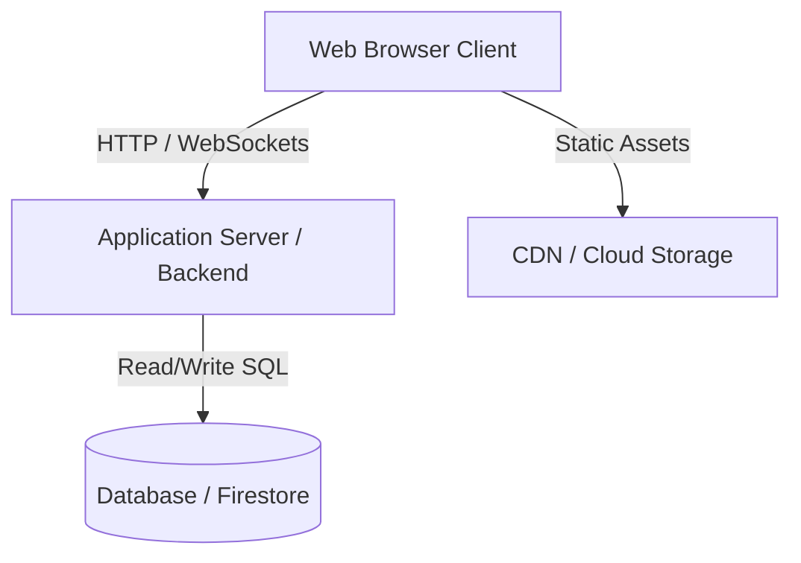
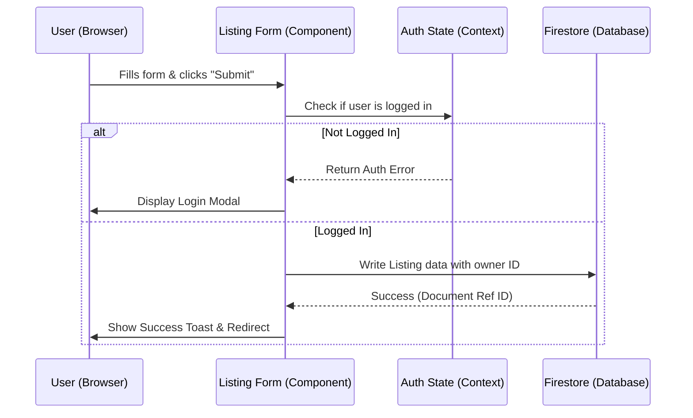

# System Architecture & Design

> **Agent Note**: This document outlines the technical design, directory structure, data models, and API definitions of the application. Refer to this to understand system boundaries and architectural standards before writing or modifying code.

---

## 1. System Overview

### 1.1 Tech Stack
- **Frontend**: [e.g., HTML5, Vanilla JavaScript, Vanilla CSS, Next.js, React + Vite]
- **State Management**: [e.g., React Context, Redux Toolkit, Vanilla JS Store]
- **Routing**: [e.g., React Router, NextJS App Router, Vanilla JS Hash Routing]
- **Styling**: [e.g., Vanilla CSS with Custom Properties, CSS Modules]
- **Backend / Database**: [e.g., Firebase Firestore, Node.js + Express, Supabase, Mock LocalStorage API]
- **Build Tools**: [e.g., Vite, Webpack, npm]
- **Hosting / Deployments**: [e.g., Vercel, Firebase Hosting, Netlify]

### 1.2 System Architecture Diagram
*Below is the high-level architecture diagram detailing the interaction between components.*



---

## 2. Directory Structure

```text
root/
├── docs/                 # Documentation (PRD, Architecture, ADRs, Roadmap)
│   ├── ADR.md            # Architecture Decision Records
│   ├── ARCHITECTURE.md   # System Architecture (this file)
│   ├── GUIDELINES.md     # Code guidelines
│   ├── HANDOFF.md        # Session handoffs
│   ├── PRD.md            # Product requirements
│   └── ROADMAP.md        # Task list
├── public/               # Static assets (images, icons, robots.txt)
├── src/                  # Application source code
│   ├── assets/           # Global styles, fonts, base CSS
│   ├── components/       # Reusable UI components
│   ├── context/          # State management / Context providers
│   ├── hooks/            # Custom React hooks (if using React)
│   ├── pages/            # Page-level components / routing views
│   ├── services/         # API clients / Firebase service wrapper
│   ├── utils/            # Helper functions and formatting utilities
│   ├── App.jsx           # Main App component
│   └── main.jsx          # Entry point
├── index.html            # Main HTML document
├── package.json          # Node dependencies and scripts
└── vite.config.js        # Build configuration (e.g., Vite)
```

---

## 3. Data Models & Database Schema

### 3.1 [Entity Name, e.g., Listing]
*Specify fields, types, and constraints.*
- **Collection/Table Name**: `listings`
- **Primary Key / ID**: `id` (string / UUID)

| Field Name | Type | Description | Constraints |
| :--- | :--- | :--- | :--- |
| `id` | String | Unique listing identifier | Required, Unique |
| `title` | String | Title of the property | Required, max 100 chars |
| `description` | String | Detailed property description | Required |
| `price` | Number | Price per month in USD | Required, Min: 0 |
| `createdAt` | Timestamp | Time when listing was created | Required |

---

## 4. API Endpoints / Service Interfaces

### 4.1 Frontend Service Interfaces (For Serverless / Frontend-only apps)
*Define the Javascript functions or SDK calls that act as services.*

#### `src/services/listingService.js`
- `getListings(filters)`: Retrieves a list of properties matching criteria.
- `getListingById(id)`: Retrieves a single property detail.
- `createListing(listingData)`: Saves a new property.

### 4.2 Backend HTTP API Routes (If applicable)
*Specify HTTP methods, paths, request payloads, and response structures.*

#### `GET /api/listings`
- **Description**: Returns all active listings.
- **Query Params**: `limit=integer`, `price_max=number`
- **Response (200 OK)**:
```json
[
  {
    "id": "abc-123",
    "title": "Modern Downtown Apartment",
    "price": 1200
  }
]
```

---

## 5. Security & State Flow

### 5.1 Data Flow Scenario (e.g., User Creating a Listing)

